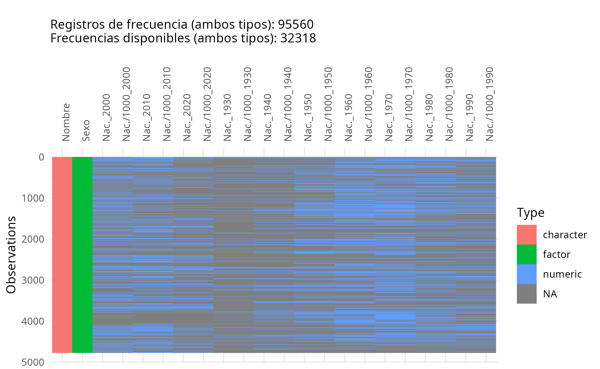
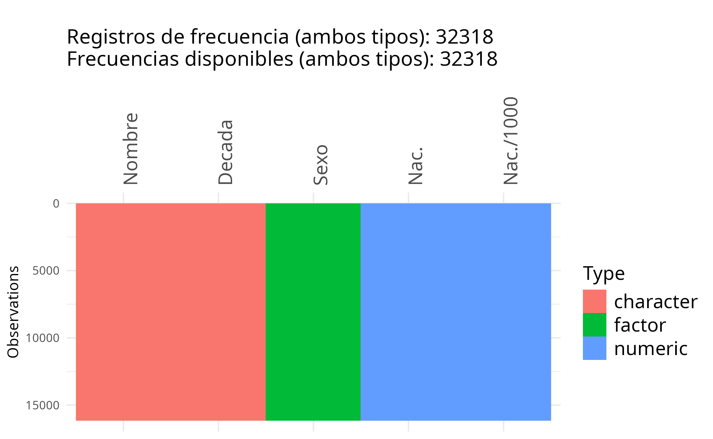
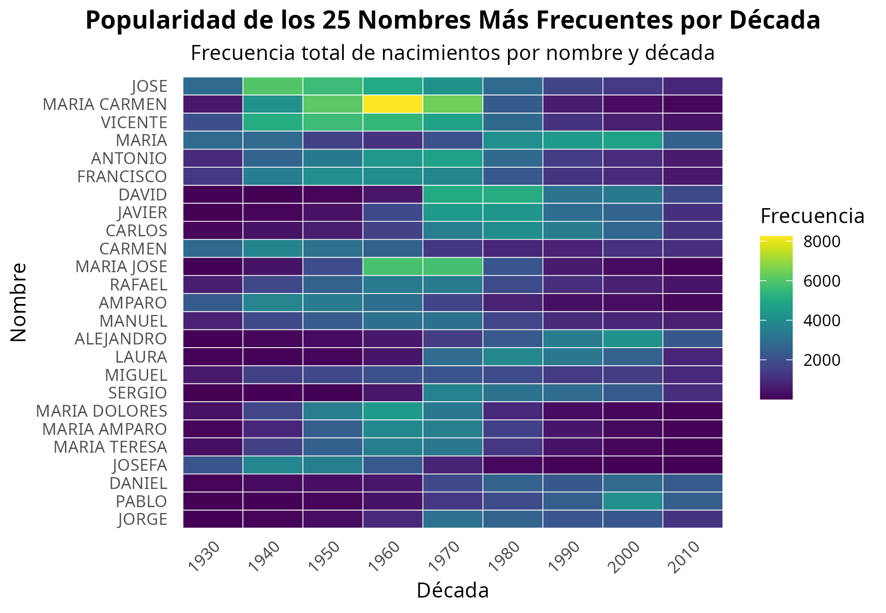
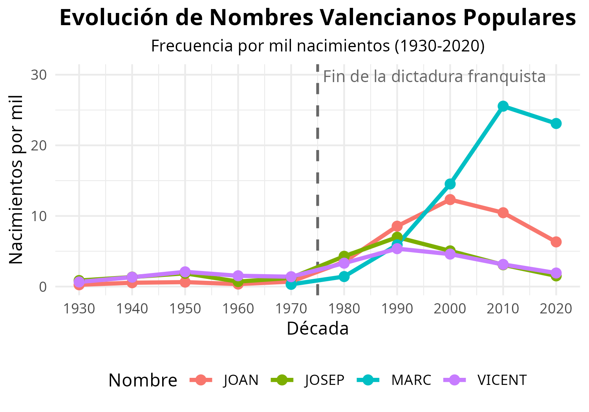

# Introducción

El presente proyecto tiene como objetivo principal la aplicación práctica de técnicas de Análisis Exploratorio de Datos. A través de la manipulación, limpieza y visualización de un conjunto de datos demográficos, se busca identificar patrones socioculturales reflejados en las tendencias de elección de nombres a lo largo de casi un siglo.

La fuente de datos seleccionada proviene del Instituto Nacional de Estadística (INE). Específicamente, se ha trabajado con los registros de frecuencia de nombres de recién nacidos para la provincia de Valencia, abarcando las décadas comprendidas entre 1930 y 2020. Estos datos se encuentran libremente disponibles y se pueden consultar en la siguiente dirección: <https://www.ine.es/tnombres/formGeneralresult.do?vista=3#_TabConsulta>.

Cabe destacar que los datos proceden del censo anual de población a fecha 01/01/2024, por lo que la década de 2020 se encuentra incompleta y sus cifras son parciales. También se ha de tener en cuenta que la frecuencia de un determinado nombre tan solo se publica si es superior o igual a 5 por provincia y década, por lo que este conjunto cuenta con una cantidad desconocida de registros perdidos. Además, los datos originales se encuentran segmentados en múltiples archivos, separados por género y década, lo que requerirá una etapa previa de integración.

## Cargar librerías a utilizar
Para el análisis de los datos utilizaremos las librerías indicadas en la siguiente tabla.  

| Uso                            |              Librerias              |
|--------------------------------|:-----------------------------------:|
| Importar el resto de librerias |                pacman               |
| Manejo de datos                |             dplyr, tidyr            |
| Visualizacion                  | ggplot2, visdat, viridis, patchwork |
| Tablas                         | kable, kableExtra                   |

```{r echo=FALSE}
library(pacman) # Para asegurarnos de que se cargarán todas las librerías aunque se tengan que instalar

p_load(stringr) # Manipulación de datos de tipo texto
p_load(tidyr, dplyr) # Manejo de datos
p_load(ggplot2, visdat, viridis) # Visualización
p_load(patchwork) # Agrupación de plots
p_load(knitr, kableExtra) # Para tablas

knitr::opts_chunk$set(
  fig.align = "center",
  out.width = "\\linewidth",
  fig.pos = "H",
  tidy = TRUE,              # Reformatea el código
  tidy.opts = list(width.cutoff = 60),  # Ancho máximo de línea
  comment = NA              # Quita los "##" de los outputs
)
```

## Importación inicial de los datos  

Para gestionar la información dispersa en múltiples archivos es necesario leer cada fichero .csv individualmente, asegurandonos de hacerlo con la codificación correcta (Windows-1252 en este caso). A partir del nombre de cada archivo se extrae información clave, como la década y el sexo al que corresponden los registros.  

Originalmente, cada archivo contiene tres variables:  

- Nombre: Nombre propio registrado.  

- Total: Número total de nacimientos con ese nombre en esa década específica (frecuencia absoluta).  

- Por mil ‰: Frecuencia relativa del nombre por cada mil nacimientos.  

Estas columnas se renombran sistemáticamente añadiendo la década como sufijo para diferenciarlas. Finalmente, todos los dataframes generados se unen en uno solo (`Nombres`) utilizando la columna `Nombre` como clave común, obteniendo así un conjunto estructurado en formato _tidy_ que permite un análisis más flexible.  


```{r echo = FALSE}
# Renombramos las variables ya que no aparecen en formato correcto si se seleccionan del csv
variables <- c('Nombre', 'Nac.', 'Nac./1000')
# Creamos una variable con todos los nombres de los ficheros
ficheros <- paste0('../data/',list.files('../data'))
# Seleccionar solo los archivos que sabemos que tienen los datos de nombres
ficheros <- grep('nombres.*[.]csv',ficheros, value=T)
# Esto recoge la parte numérica al final del fichero que es donde están las últimas dos cifras de la década
decadas <- gsub("[.]csv","",str_extract(list.files('../data'),'[a-z0-9\\-]+[.]csv'))

# Convierte los números a década completa
decadas <- sapply(decadas, function(x) {
  # Si es 30-39 lo pasamos a 1930
  if (grepl("30-39", x)) {
    return("1930")
  }
  # Extrae las dos últimas cifras para convertirlas a década completa
  num <- as.numeric(str_extract(x, "\\d{2}$"))
  if (is.na(num)) return(NA)
  
  # Partimos de 1930 hasta 2020
  if (num >= 30) {
    return(as.character(1900 + num))
  } else {
    return(as.character(2000 + num))
  }
})
# Elimina los NAs correspondientes a menor30
valid_dec <- !is.na(decadas)
ficheros <- ficheros[valid_dec]
decadas <- decadas[valid_dec]


PrimerH <- TRUE
PrimerM <- TRUE
i <- 1
while(i<=length(ficheros)){
  # Lee cada fichero en una variable auxiliar
  auxdf <- read.csv(ficheros[i], header = F, sep='\t', skip=7, fileEncoding = 'Windows-1252', dec=',')
  # Convierte los miles realmente a miles (el . hacía que fuera considerado string)
  auxdf[,'V3'] <- as.numeric(gsub('[.]','',auxdf[,'V3']))
  # Sale una columna solo con el numero de nombre 1,2,3... la quitamos
  auxdf <- auxdf[,-1]
  colnames(auxdf) <- c(c('Nombre'),paste0(variables[c(2,3)],'_',decadas[i]))
  
  # Eliminar las filas que salen con NA (hacer ahora porque si se hace en el grande puede borrar algunas que tengan NA solo   en algunos años)
  auxdf <- auxdf[!(rowSums(is.na(auxdf))>0),]
  # Juntaremos todos los datasets de nombres de hombre y luego todos los de mujer, al final ya lo uniremos todo
  if(grepl('H',ficheros[i])){ # Identifica qué datos son de hombres porque hay H en el nombre del fichero, para mujeres M
    if(PrimerH){
      TotalH <- auxdf
      PrimerH <- FALSE
    } else{
      # El resto se unen a partir de coincidencias en la columna de nombres
      TotalH <- merge(x = TotalH, y = auxdf, by = "Nombre", all=TRUE)
    }
  } else if(grepl('M',ficheros[i])){
    if(PrimerM){
      TotalM <- auxdf
      PrimerM <- FALSE
    } else{
      TotalM <- merge(x = TotalM, y = auxdf, by = "Nombre", all=TRUE)
    }
  }
  
  i <- i+1
}
# Añadimos aquí las columnas de sexo ya que sabemos cuál corresponde a cada grupo de datos
TotalM$Sexo <- 'Mujer'
TotalH$Sexo <- 'Hombre'

# Dataset final total uniendo el de hombres y mujeres (luego vemos como ordenamos filas y columnas)
Nombres <- rbind(TotalH,TotalM)
Nombres$Sexo <- factor(Nombres$Sexo)

# Hemos guardado muchas variables auxiliares que ya no se van a utilizar, limpiamos las variables excepto el dataframe final
rm(list = grep('Nombres', ls(), value=TRUE, invert = TRUE))
```

Una vez hecha la unión podemos realizar una primera evaluación visual de los datos con herramientas de la librería `visdat`.  
```{r echo=FALSE, fig.dim=c(3,2), fig.show='hide'}
# Contamos todas las frecuencias disponibles viendo cuáles no son NA y sumando
completos <- sum(!is.na(Nombres[,colnames(Nombres)!=c('Nombre','Sexo')]))
# Contamos todos los elementos del dataframe reservados para medidas de frecuencias
totales <- prod(dim(Nombres[,colnames(Nombres)!=c('Nombre','Sexo')]))
info_registros <- paste('\nRegistros de frecuencia (ambos tipos):',totales,
                        '\nFrecuencias disponibles (ambos tipos):',completos, collapse = ' ')


vis_Nombres <- vis_dat(Nombres) + labs(
    subtitle = info_registros
  ) +
  theme(
    axis.text.x   = element_text(angle = 90))
# Ya no la guardo porque ya la tengo y si se guarda mientras se hace knit sale mal
#suppressMessages(ggsave('../figs/VisdatNombresSucio.png', vis_Nombres))

# Para que se vea bien en el pdf añadiremos la figura como imagen
```

```{r, echo=FALSE, out.width='85%', fig.align='center'}

```

Esta representación permite observar de manera sencilla los tipos de las variables. Podemos comprobar que estos han sido estructurados de manera correcta ya que contamos con `Nombre` de tipo `character` (propio de cadenas de texto), `Sexo` como variable de tipo factor (adecuado para variables categóricas con limitadas opciones) y todas las frecuencias presentes son de tipo numérico.  
No obstante también podemos observar claramente otra característica principal del dataframe creado, que es la gran cantidad de datos faltantes (`NA`) que hemos introducido a causa de la combinación de diversos conjuntos de datos con diferente nombre. Por otra parte, también contamos con multitud de columnas con información de dos variables (frecuencia de nacimientos, ya sea absoluta o por 1000, y año), lo cual dificultará el acceso y manejo de los datos en etapas posteriores.  

Ambos problemas, podrán resolverse transformando este dataframe resultante a formato _tidy_, facilitando así su manipulación y análisis gráfico. 


## Convertir el dataframe a formato _tidy_

El dataframe `Nombres` contiene inicialmente múltiples columnas asociadas a cada década, lo que dificulta su manipulación y análisis. Para obtener una estructura más eficiente, se procede a su transformación a formato _tidy_ mediante funciones de los paquetes `tidyr` y `dplyr.` Esta conversión a formato largo permite condensar estas múltiples columnas, quedando variables más claras: Nombre, Sexo, Década, Nac. y Nac./1000.  

Separar las variables de década y frecuencias en dos columnas también nos permitirá limpiar el dataframe, eliminando registros correspondientes a las décadas en que un nombre determinado tiene por frecuencia no disponible (`NA`) sin afectar a los registros del resto de variables.  

```{r echo = FALSE}
# Pasamos a longer para poder manejar mejor los datos a la hora de representarlos o hacer cálculos estadísticos
Nombres_longer <- Nombres %>%
  relocate(`Nac._2000`:`Nac./1000_2020`, .after = `Nac./1000_1990`) %>%  # Reordenamos primero las columnas de 1930 a 2020
  pivot_longer(cols = -c(Nombre, Sexo), names_to = "TipoDecada", values_to = "Valor") %>%
  separate(TipoDecada, into = c("Tipo", "Decada"), sep = "_") # Dividimos las dos variables de nacimientos en dos columnas

# Convertimos a wider para poder obtener por separado ambas variables de nacimientos
Nombres_tidy <- Nombres_longer %>% 
  pivot_wider(names_from = "Tipo", values_from = "Valor") %>%
  drop_na()
```

Una vez tranformado el dataframe a formato _tidy_, realizamos de nuevo una inspección visual de su contenido.  

```{r echo=FALSE, fig.dim=c(3,2), fig.show='hide'}
# Contamos todas las frecuencias disponibles a partir del número de columnas (eliminamos NAs)
completos <- 2*sum(complete.cases(Nombres_tidy)) # *2 porque contamos ambos tipos de frecuencia
# Contamos todos los elementos del dataframe reservados para medidas de frecuencias
totales <- prod(dim(Nombres_tidy[,c(3,4)]))
info_registros <- paste('\nRegistros de frecuencia (ambos tipos):',totales,
                        '\nFrecuencias disponibles (ambos tipos):',completos, collapse = ' ')

vis_dat(Nombres_tidy) + 
  labs(
    subtitle = info_registros
  ) + 
  theme_minimal(base_size = 8) +
  theme(
  axis.text.x = element_text(angle = 90)) 

vis_Nombres_tidy <- vis_dat(Nombres_tidy) + labs(
    subtitle = info_registros
  ) +
  theme(
    axis.text.x   = element_text(angle = 90, size = 14),
    plot.subtitle = element_text(size=15),
    legend.text   = element_text(size = 14),
    legend.title  = element_text(size = 14))
# Ya no la guardo porque ya la tengo y si se guarda mientras se hace knit sale mal
#suppressMessages(ggsave('../figs/VisdatNombresTidy.png', vis_Nombres_tidy))
```

```{r, echo=FALSE, out.width='70%', fig.align='center'}

```

Podemos comprobar que al tranformar el dataframe hemos eliminado los registros que no contienen información sobre las frecuencias (que no son de utilidad para el análisis a realizar) sin reducir el número de observaciones. La estructura _tidy_ será en consecuencia más sencilla de manipular y más eficiente para contener la información disponible.  

Cabe destacar también que la nueva variable generada para las décadas es de tipo carácter, dado que para nuestro análisis serán utilizadas como clasificador (variable categórica) esta estructura es adecuada para los objetivos del análisis, al no estar haciendo operaciones con fechas tampoco será necesario pasar a formato fecha.


# Objetivos (añadir algo más cuando lo acabemos)
Los objetivos principales de este trabajo son los siguientes:

- Analizar la evolución temporal de la popularidad de los nombres en la provincia de Valencia.

- Comparar las tendencias entre los distintos géneros.

- Identificar la aparición y desaparición de nombres a lo largo del tiempo.

- Estudiar la influencia de factores socioculturales y lingüísticos en la elección de nombres.


# Análisis

## Análisis univariante

### Descripción general de los datos

En primer lugar es conveniente conocer, de manera general, las características de el conjunto de datos con el que vamos a trabajar. Para ello haremos un sumario inicial de los datos en formato tidy.   
```{r echo=FALSE}
# Todos los paquetes para hacer tablas que he encontrado han tenido problemas para crear una tabla con summary()
## creamos aquí una función que corrija el formato de la tabla y la haga dataframe para que aparezca bien en el documento
summary_para_table <- function(df){
  # Primero hay que aplicar summary por separado a cada elemento, ya que queremos editarlos más adelante
  sumlis <- lapply(df, summary)
  # Obtenemos la longitud máxima ya que luego editaremos los elementos cortos para que todos tengan el mismo número de filas en el dataframe
  max_len <- max(sapply(sumlis, length))
  
  for(i in 1:length(sumlis)){
    base <- sumlis[[i]]
    if(is.numeric(base)){
      sumlis[[i]] <- paste0(names(base),': ', round(base, digits=3))
    } else{
      sumlis[[i]] <- paste0(names(base),': ', base)
    }
    
    # Editamos longitud de cada vector hasta que todos sean iguales, ponemos " " que aparecerá en blanco en la tabla
    longitud_actual <- length(sumlis[[i]])
    while(longitud_actual < max_len){
      sumlis[[i]] <- c(sumlis[[i]] ," ")
      longitud_actual <- longitud_actual+1
    }
  }
  # Pasamos a formato de dataframe, con los cambios que hemos hecho lo hará en el formato correcto
  df_summary <- data.frame(sumlis, check.names = FALSE)
  return(df_summary)
}
# Obtenemos nuestra tabla
k <- summary_para_table(Nombres_tidy)
```


```{r echo=FALSE, results='asis'}
if(knitr::is_latex_output()){
  # Para editar el tamaño de la tabla en el pdf (son muy grandes)
  k %>% kable(caption = "Resumen general de nuestro conjunto de datos en formato tidy",
              format="latex", booktabs = TRUE) %>%
  kable_styling(latex_options=c("scale_down","hold_position"), full_width = F,
                font_size = 8)
} else{
  # En el propio rmarkdown creo que aparece mejor el formato pr defecto
  print(k)
}
 
```

A partir del sumario inicial mostrado previamente ya se puede identificar una característica fundamental de nuestro conjunto de datos. La distribución frecuencial cuenta con una gran cantidad de nombres a frecuencias bajas, como podemos deducir a partir de la mediana y los cuartiles, pero la media y el máximo de frecuencia de los nombres son muy superiores a estos valores.   

Por estos factores, podemos suponer que contamos con una gran cantidad de nombres de baja frecuencia, pero la cantidad de nacimientos se encuentra concentrada, mayoritariamente, en un comparativamente pequeño conjunto de nombres. La distribución de frecuencias es, por tanto, no gaussiana, por lo que no es conveniente usar las técnicas usuales que estén adaptadas a esta distribución. En su lugar, se emplearán métodos exploratorios y visuales que permitan captar adecuadamente esta asimetría y las posibles tendencias en el conjunto de nombres.


# Objetivos 
1) Realizar un estudio de frecuencias de los nombres en la Provincia de Valencia entre 1930 y 2020, identificando los más populares tanto por década como en el conjunto del periodo estudiado.
2) Examinar la evolución temporal de los nombres en la Provincia de Valencia, con el fin de detectar patrones y tendencias significativas.
3) Analizar la aparición de nuevos nombres y la desaparición progresiva de otros a lo largo del tiempo.
4) Explorar la posible relación entre los cambios en la elección de nombres y factores socioculturales asociados a cada etapa histórica.

### Nombres más populares y su evolución temporal

Para determinados análisis también es conveniente tener datos absolutos sobre la cantidad de nacimientos totales para cada nombre y su proporción, obtendremos esta información a partir de la manipulación de nuestro dataframe tidy original.  
A continuación mostramos una pequeña sección (la cabecera) de este conjunto de datos, como representativo del conjunto completo.

```{r echo = FALSE}
# VARIABLES CATEGÓRICAS (Nombre, Sexo, Decada) - FRECUENCIAS
#Como sabemos que en la variable sexo las 2 categorias estan en proporción 50-50 y en la variable decada las categorias estan en proporción 0.1, obviamos este estudio y nos concentramos en los nombres. 

# Frecuencia de la variable 'Nombre'
#A partir del dataframe tidy, agrupo por nombre y sumo la cantidad de nacimientos totales. Luego para hacer la proporción, debo desagrupar. Finalmente ordeno acorde al conteo de personas con ese nombre.
Frecuencia_nombres <- Nombres_tidy %>%
  group_by(Nombre, Sexo) %>%
  summarise(Nacimientos_Totales = sum(Nac., na.rm = TRUE), .groups = "drop")  %>% #Sumo los nacimientos
  mutate(Proporcion = Nacimientos_Totales / sum(Nacimientos_Totales)) %>% #Proporción
  arrange(desc(Nacimientos_Totales))  

```

```{r echo=FALSE, results='asis'}
if(knitr::is_latex_output()){
  # Para editar el tamaño de la tabla en el pdf (son muy grandes)
  head(Frecuencia_nombres) %>% kable(caption = "Muestra del resultado del estudio de frecuencias totales",
              format="latex", booktabs = TRUE) %>%
  kable_styling(latex_options=c("scale_down","hold_position"), full_width = F,
                font_size = 8)
} else{
  # En el propio rmarkdown creo que aparece mejor el formato pr defecto
  print(head(Frecuencia_nombres))
}

```

Esta distribución facilitará, entre otras cosas, acceder a los nombres globalmente más populares (hemos escogido utilizar los 25 nombres más populares), extrayéndolos de esta estructura podemos luego realizar un análisis de su evolución temporal utilizando un heatmap, como se muestra a continuación.  


```{r, echo=FALSE}
top25_nombres <- Frecuencia_nombres %>%
  slice(1:25) %>%
  pull(Nombre)

top25 <- Nombres_tidy %>%
  filter(Nombre %in% top25_nombres, Decada != 2020)

heatmap_top25 <- ggplot(
  top25,
  aes(x = factor(Decada),
      y = reorder(Nombre, Nac.),
      fill = Nac.)
) +
  geom_tile(color = "white") +
  scale_fill_viridis(option = "D", direction = 1) +
  labs(
    title = "Popularidad de los 25 Nombres Más Frecuentes por Década",
    subtitle = "Frecuencia total de nacimientos por nombre y década",
    x = "Década",
    y = "Nombre",
    fill = "Frecuencia"
  ) +
  theme_minimal() +
  theme(
    plot.title = element_text(hjust = 0.5, face = "bold"),
    plot.subtitle = element_text(hjust = 0.5),
    axis.text.x = element_text(angle = 45, vjust = 1, hjust = 1),
    panel.grid = element_blank()
  )

# Opción de guardar en un comentario ya que no es necesaria en todas las ejecuciones
suppressMessages(ggsave('../figs/Heatmap25.png', heatmap_top25))
```

```{r, echo=FALSE, out.width='75%', fig.align='center'}

```


### Pruebas de evoluciones temporales

El análisis de nombres valencianos, como "Marc", muestra una gran evolución tras finalizar la dictadura, indicando la posible opresión cultural y lingüística durante este periodo. 

```{r echo = FALSE, fig.show='hide'}
# Ranking de nombres por década y sexo
Decada_2000 <- Nombres_tidy %>%
  filter(Decada == 2000, Sexo == "Hombre") %>% 
  select(Nombre, `Nac./1000`, Sexo) %>%
  arrange(desc(`Nac./1000`)) %>% 
  group_by(Sexo)

# Evolución de nombres a lo largo del tiempo
nombres_seleccionados <- c("MARC", "JOAN", "VICENT", "JOSEP")

Nombres_evol_plot <- Nombres_tidy %>%
  filter(Nombre %in% nombres_seleccionados) %>%
  mutate(Decada = as.numeric(Decada)) %>%
  filter(!is.na(`Nac./1000`))

Plot_nombres_valencianos <- ggplot(Nombres_evol_plot, aes(x = Decada, y = `Nac./1000`, color = Nombre, group = Nombre)) +
  geom_vline(xintercept = 1975, linetype = "dashed", color = "gray40", linewidth = 0.8) +
  annotate("text", x = 1976, y = Inf, label = "Fin de la dictadura franquista",
           hjust = 0, vjust = 1.5, color = "gray40", size = 3.5) +
  geom_line(linewidth = 1.2) +
  geom_point(size = 2.5) +
  labs(
    title = "Evolución de Nombres Valencianos Populares",
    subtitle = "Frecuencia por mil nacimientos (1930-2020)",
    x = "Década",
    y = "Nacimientos por mil",
    color = "Nombre"
  ) +
  scale_x_continuous(breaks = seq(1930, 2020, by = 10)) +
  expand_limits(y=30) + # Para que la etiqueta Fin de la dictadura franquista no se solape en el pdf
  theme_minimal() +
  theme(
    plot.title = element_text(hjust = 0.5, face = "bold", size = 14),
    plot.subtitle = element_text(hjust = 0.5, size = 10),
    legend.position = "bottom"
  )

#print(Nombre_evol) # Al acabar la dictadura crecen rápidamente nombres valencianos como Marc
# Opción de guardar en un comentario ya que no es necesaria en todas las ejecuciones
#suppressMessages(ggsave('../figs/NombresValencianos.png', Plot_nombres_valencianos))
```

```{r, echo=FALSE, out.width='80%', fig.align='center'}

```


También se observa que los nombres unisex (registrados tanto para hombres como para mujeres) representan un porcentaje muy bajo del total y, por lo general, su uso tiende a estar más sesgado hacia uno de los dos sexos.  
```{r echo = FALSE}
# Función para ver qué nombres aparecen en ambos sexos
Nombres_nb <- function(){
  Nombres_tidy %>%
    distinct(Nombre, Sexo) %>% 
    group_by(Nombre) %>% 
    filter(n() == 2) %>% 
    pull(Nombre) %>% 
    unique()
}
# Función para ver qué nombres aparecen en ambos sexos por década
Nombres_nb_decada <- function(decada){
  Nombres_tidy %>%
    filter(Decada == decada) %>%
    drop_na() %>%
    distinct(Nombre, Sexo) %>% 
    group_by(Nombre) %>% 
    filter(n() == 2) %>% 
    pull(Nombre) %>% 
    unique()
}

unisex <- Nombres_nb() # Opción para todas las décadas

# Los nombres unisex son un porcentaje muy bajo del total (0.504%)
porcentaje_nb <- 100*length(Nombres_nb())/length(unique(Nombres_tidy$Nombre))
# Para mostrarlo en el texto posterior
porcentaje_nb <- round(porcentaje_nb, digits = 3)
porcentaje_nb <- paste0(porcentaje_nb,'%')
```

```{r echo = FALSE}
# Tabla para ver qué porcentaje de cada género tiene cada nombre unisex
cada_sexo_nb <- Nombres_tidy %>%
  filter(Nombre %in% unisex) %>%
  group_by(Nombre, Sexo) %>%
  summarise(Total=sum(Nac., na.rm = TRUE)) %>%
  pivot_wider(names_from = Sexo, values_from = Total) %>%
  group_by(Nombre) %>%
  summarise(`% Hombres`=Hombre*100/(Hombre+Mujer), `% Mujeres`=Mujer*100/(Hombre+Mujer))


# Tabla con los resultados
if(knitr::is_latex_output()){
  # Para añadirla al pdf la dividimos en 2 ya que es muy larga
  kable(cada_sexo_nb,
        caption = 'Nombres unisex con su correspondiente porcentaje para cada género',
              format="latex", booktabs = TRUE) %>%
  kable_styling(latex_options=c("scale_down","hold_position"), full_width = F)
} else{
  # En el Rmarkdown creo que se visualiza mejor con el formato por defecto
  print(cada_sexo_nb)
  #cada_sexo_nb %>% kable(caption = 'Nombres unisex con su correspondiente porcentaje para cada género')
}

```


## Análisis bivariante
A la hora de trabajar con nombres encontramos un muy claro sesgo de género, como hemos podido comprobar anteriormente al buscar nombres unisex (los encontramos en baja proporción y la mayoría de ellos tienen gran sesgo).  

Por ello es conveniente en la mayoría de los casos realizar el análisis de nuestro conjunto de datos dividiendo los resultados por sexo, como haremos a continuación.

### Gráficos tendencias nombres

Se generan diversas representaciones visuales para analizar la evolución temporal de los datos:

- Volumen de nacimientos: Permite identificar fluctuaciones demográficas, como el baby boom o periodos de descenso en la natalidad.

- Características de los nombres: Analiza cambios estilísticos, como la evolución de la longitud media y la porcentaje de nombres compuestos respecto al total. Esto revela tendencias culturales, evidenciando el abandono de nombres tradicionales largos en favor de opciones más cortas.

- Diversidad de nombres: Se observa la tendencia en la cantidad de nombres distintos utilizados a lo largo de las décadas, indicando una tendencia hacia una mayor heterogeneidad en la elección de estos.

- Renovación: Gráficos sobre la aparición de nuevos nombres y la desaparición de aquellos que quedan en desuso con el paso del tiempo.  

```{r echo = FALSE}
# Generamos un gráfico a partir de los datos y variables introducidos
grafico_evolucion <- function(data, y_var, y_lab, title, subtitle, y_format = waiver()){
  
  # Convierte el nombre de la columna de forma que aes() lo pueda interpretar 
  y_sym <- sym(y_var)
  
  # Convierte la columna "Década" en numérico para que el eje X sea continuo
  plot_data <- data %>%
    mutate(Decada = as.numeric(Decada))
  
  #!!y_sym usa la columna correspondiente a y_var
  ggplot(plot_data, aes(x = Decada, y = !!y_sym, color = Sexo, group = Sexo)) + 
    geom_line(linewidth = 1) +
    geom_point(size = 2.5) +
    labs(
      title = title,
      subtitle = subtitle,
      x = "Década",
      y = y_lab,
      color = "Sexo"
    ) +
    # Asegura que todas las décadas (1930, 1940, etc.) aparezcan en el eje X
    scale_x_continuous(breaks = seq(min(plot_data$Decada, na.rm = TRUE), 
                                    max(plot_data$Decada, na.rm = TRUE), 
                                    by = 10)) +
    # Permite un formato personalizado para el eje Y (para usar "%")
    scale_y_continuous(labels = y_format) +
    theme(
      plot.title = element_text(hjust = 0.5, face = "bold"),
      plot.subtitle = element_text(hjust = 0.5),
    )
}

# Dataframe base con NAs filtrados
Nombres_validos <- Nombres_tidy %>%
  filter(!is.na(Nac.) & Nac. > 0) %>%
  mutate(Decada_num = as.numeric(Decada))

## Nacimientos por década

# Nacimientos totales agrupando por "Decada" y "Sexo"
nacimientos_por_sexo <- Nombres_tidy %>%
  group_by(Decada, Sexo) %>%
  summarise(TotalNacimientos = sum(Nac., na.rm = TRUE), .groups = "drop")

# Calculamos el total de "Ambos" sumando los resultados anteriores
nacimientos_ambos <- nacimientos_por_sexo %>%
  group_by(Decada) %>%
  summarise(TotalNacimientos = sum(TotalNacimientos, na.rm = TRUE)) %>%
  mutate(Sexo = "Ambos")

# Unimos los dataframes (por sexo y "Ambos") en uno solo y los ordenamos
Total_Nacimientos_Decada <- bind_rows(nacimientos_por_sexo, nacimientos_ambos) %>%
  arrange(Decada, Sexo)

plot_nacimientos <- grafico_evolucion(
  data = Total_Nacimientos_Decada %>% filter(Decada != "2020"),
  y_var = "TotalNacimientos",
  y_lab = "Total de Nacimientos",
  title = "Evolución del Número Total de Nacimientos",
  subtitle = "Por década y género (1930-2010)",
)


## Longitud media de nombres por década

# Calculamos el número de carácteres de cada nombre
Nombres_longitud <- Nombres_validos %>%
  mutate(Longitud = nchar(Nombre))

# Calculamos la media ponderada por sexo. # Nombres más comunes tienen mayor peso en la media
medias_por_sexo <- Nombres_longitud %>%
  group_by(Decada, Sexo) %>%
  summarise(LongitudMedia = weighted.mean(Longitud, w = Nac.), .groups = "drop")

# Para ambos sexos se recalcula la media
medias_ambos_sexos <- Nombres_longitud %>%
  group_by(Decada) %>%
  summarise(LongitudMedia = weighted.mean(Longitud, w = Nac.), .groups = "drop") %>%
  mutate(Sexo = "Ambos")

Longitud_media_comb <- bind_rows(medias_por_sexo, medias_ambos_sexos) %>%
  arrange(Decada, Sexo)

plot_longitud <- grafico_evolucion(
  data = Longitud_media_comb,
  y_var = "LongitudMedia",
  y_lab = "Longitud Media del Nombre",
  title = "Evolución de la Longitud Media de los Nombres",
  subtitle = "Ponderada por el número de nacimientos (1930-2020)"
)


## Porcentaje nombres compuestos por década y sexo

# Filtramos solo los nombres que contienen un espacio
Nombres_comp <- Nombres_validos %>%
  filter(grepl(" ", Nombre))

# Sumamos los nacimientos de estos nombres compuestos, por sexo
comp_por_sexo <- Nombres_comp %>%
  group_by(Decada, Sexo) %>%
  summarise(TotalNacimientosCompuestos = sum(Nac., na.rm = TRUE), .groups = "drop")

# Sumamos los totales por sexo para obtener el total de "Ambos"
comp_ambos <- comp_por_sexo %>%
  group_by(Decada) %>%
  summarise(TotalNacimientosCompuestos = sum(TotalNacimientosCompuestos, na.rm = TRUE)) %>%
  mutate(Sexo = "Ambos")

Nacimientos_comp <- bind_rows(comp_por_sexo, comp_ambos) %>%
  arrange(Decada, Sexo)

# Calculamos el porcentaje
Porcentaje_Comp_Decada <- Total_Nacimientos_Decada %>%
  left_join(Nacimientos_comp, by = c("Decada", "Sexo")) %>%
  mutate(
    TotalNacimientosCompuestos = replace_na(TotalNacimientosCompuestos, 0)
    ) %>%
  mutate(
    PorcentajeCompuestos = (TotalNacimientosCompuestos / TotalNacimientos) * 100
    ) %>%
  select(Decada, Sexo, PorcentajeCompuestos)

plot_compuestos <- grafico_evolucion(
  data = Porcentaje_Comp_Decada,
  y_var = "PorcentajeCompuestos",
  y_lab = "Porcentaje de Nacimientos (%)",
  title = "Evolución del Porcentaje de Nombres Compuestos",
  subtitle = "Respecto al total de nacimientos de cada grupo (1930-2020)",
  y_format = scales::label_number(accuracy = 0.1, suffix = " %") # Este formato muestra el eje Y como "XX.X %"
)


## Cantidad de nombres distintos por década y sexo

# Calculamos la cantidad de nombres distintos por década y sexo
variedad_sexo <- Nombres_validos %>%
  group_by(Decada, Sexo) %>%
  summarise(NombresDistintos = n_distinct(Nombre), .groups = "drop")

variedad_ambos <- Nombres_validos %>%
  group_by(Decada) %>%
  summarise(NombresDistintos = n_distinct(Nombre), .groups = "drop") %>%
  mutate(Sexo = "Ambos")

Variedad_Nombres_Decada <- bind_rows(variedad_sexo, variedad_ambos) %>%
  arrange(Decada, Sexo)

plot_variedad <- grafico_evolucion(
  data = Variedad_Nombres_Decada %>% filter(Decada != "2020"),
  y_var = "NombresDistintos",
  y_lab = "Nombres Distintos",
  title = "Evolución de la Variedad de Nombres Distintos",
  subtitle = "Por década y género (1930-2010)"
)


## Nuevos nombres por década y sexo

Nombres_primera_aparicion <- Nombres_validos %>%
  group_by(Nombre, Sexo) %>%
  summarise(PrimeraDecada = min(Decada_num, na.rm = T), .groups = "drop")

nuevos_nombres_decada <- Nombres_primera_aparicion %>%
  group_by(Decada = as.character(PrimeraDecada), Sexo) %>%
  summarise(NuevosNombres = n(), .groups = "drop")

nuevos_nombres_ambos <- nuevos_nombres_decada %>%
  group_by(Decada) %>%
  summarise(NuevosNombres = sum(NuevosNombres, na.rm = T), .groups = "drop") %>%
  mutate(Sexo = "Ambos")

Nombres_Nuevos <- bind_rows(nuevos_nombres_decada, nuevos_nombres_ambos) %>%
  arrange(Decada, Sexo)

plot_novedad <- grafico_evolucion(
  data = Nombres_Nuevos %>% filter(Decada != "2020"),
  y_var = "NuevosNombres",
  y_lab = "Nombres Nuevos",
  title = "Cantidad de Nombres Nuevos",
  subtitle = "Por década y género (1930-2010)"
)


## Número de nombres desaparecidos con el tiempo

Nombres_ultima_aparicion <- Nombres_validos %>%
  group_by(Nombre, Sexo) %>%
  summarise(UltimaDecada = max(Decada_num, na.rm = TRUE), .groups = "drop")

# Excluimos 2020 porque es la última década que tenemos disponible
max_decada_total <- max(Nombres_validos$Decada_num, na.rm = TRUE)

Nombres_desaparecidos <- Nombres_ultima_aparicion %>%
  filter(UltimaDecada < max_decada_total)

desaparecidos_por_sexo <- Nombres_desaparecidos %>%
  group_by(Decada = as.character(UltimaDecada), Sexo) %>%
  summarise(NombresDesaparecidos = n(), .groups = "drop")

desaparecidos_ambos <- desaparecidos_por_sexo %>%
  group_by(Decada) %>%
  summarise(NombresDesaparecidos = sum(NombresDesaparecidos, na.rm = TRUE), .groups = 'drop') %>%
  mutate(Sexo = "Ambos")

Total_Nombres_Desaparecidos <- bind_rows(desaparecidos_por_sexo, desaparecidos_ambos) %>%
  arrange(Decada, Sexo)

plot_desaparicion <- grafico_evolucion(
  data = Total_Nombres_Desaparecidos,
  y_var = "NombresDesaparecidos",
  y_lab = "Nombres Desaparecidos",
  title = "Nombres que Desaparecen por Década",
  subtitle = "Nombres vistos por última vez en esa década (1930-2010)",
)

plot_nacimientos / plot_variedad 
plot_compuestos / plot_longitud 
plot_novedad / plot_desaparicion
```


```{r echo = FALSE}
# Opción de guardar en un comentario ya que no es necesaria en todas las ejecuciones
#suppressMessages(ggsave('../figs/Nacimientos-Variedad.png', plot_nacimientos / plot_variedad))
#suppressMessages(ggsave('../figs/Compuestos-Longitud.png', plot_compuestos / plot_longitud))
#suppressMessages(ggsave('../figs/Novedad-Desaparicion.png', plot_novedad / plot_desaparicion))
```


### Nombres de máxima popularidad en función de década y sexo

```{r echo = FALSE}
#Ver los 5 nombres más populares de mujeres y los 5 nombres más populares de hombre por año 
Nom_populares <- Nombres_tidy %>%
  group_by(Sexo, Decada) %>%
  arrange(desc(Nac.)) %>% #ordena descendentemente (cantidad de mujeres nacidas con ese nombre)
  slice(1:5) %>%
  ungroup()

# Para organizar mejor la tabla creamos otra variable

Nom_populares_tabla <- Nom_populares %>% select(Decada, Sexo, Nombre) %>%
  group_by(Decada, Sexo) %>%
  mutate(Posicion = row_number()) %>%
  ungroup() %>%
  pivot_wider(names_from = Posicion, values_from = Nombre) %>%
  mutate('5 nombres más populares (de mayor a menor)' = paste(`1`,`2`,`3`,`4`,`5`, sep=", ")) %>%
  select(Decada, Sexo, `5 nombres más populares (de mayor a menor)`)

# Mostramos la tabla con el resultado para nombres populares
if(knitr::is_latex_output()){
  # Para añadirla al pdf la dividimos en 2 ya que es muy larga
  kable(Nom_populares_tabla,
        caption = 'Cinco nombres más populares por década y sexo',
              format="latex", booktabs = TRUE) %>%
  kable_styling(latex_options=c("scale_down","hold_position"), 
                full_width = F, font_size = 8)
} else{
  # En el Rmarkdown creo que se visualiza mejor con el formato por defecto
  print(Nom_populares_tabla)
}

lista_df_decadas <- Nom_populares %>%
  group_by(Decada) %>%
  group_split(.keep = TRUE)

lista_graficos_finales <- list()


for (df_decada in lista_df_decadas) {
  decada <- unique(df_decada$Decada)
  
  g_actual <- ggplot(data = df_decada, 
                     aes(x = reorder(Nombre, Nac.), y= Nac.)) + 
    geom_col(aes(fill=Sexo)) + 
    geom_text(aes(label= Nac.), vjust= -0.5, size= 2.5) + 
    facet_wrap(~Sexo, scales= 'free_x') + 
    labs(title= 'Top 5 nombres más populares por sexo', 
         subtitle= paste('Decada de', decada, 'en la Provincia de Valencia'), 
         x= NULL,
         y = 'Numero de nacimientos') + 
    theme_light() + 
    theme(axis.text.x = element_text(angle = 45, hjust= 1), 
          plot.title = element_text(face= 'bold', hjust= 0.5), 
          plot.subtitle = element_text(hjust= 0.5))
  
  print(g_actual)
  # Para guardar las gráficas, estará comentado cuando no lo usemos
  #archivo <- paste0('../figs/5Populares',decada,'.png')
  #suppressMessages(ggsave(archivo, g_actual))
}
```
Notar en los gráficos que hasta 1970-1980 habia mayor cantidad de nombres religiosos, pero a partir de 1990 esta tendencia decrece.


# Comparación de popularidad de un grupo de nombres

Podemos aplicar el mismo procedimiento que hemos utilizado para evaluar características generales para extraer información de una determinada muestra de nombres de interés.  
Como curiosidad, hemos escogido para este proyecto utilizar como muestra los nombres de nuestros compañeros, y extraer datos acerca de la frecuencia para la década en la que nacieron la mayoría de ellos (2000).

```{r echo = FALSE}
#Ranking nombres de clase 

nombres_clase <- toupper(c("Adrian", "Adriana", "Alvaro", "Ana", "Axel", "Azahara", "Carlos", "Clara", "Cristhian", "Fabian", "Florencia", "Hector", "Irene", "Iyán", "Javier", "Jeremy", "Joan", "Jose", "Juan", "Lucia",  "María de los Ángeles", "Mario", "Oscar", "Pablo", "Pol", "An"))

ranking_nombres_clase <- Nombres_tidy %>%
  filter(Decada == '2000', # solo 2000
         Nombre %in% nombres_clase) %>% 
  select(Decada, Nombre, Nac.) %>%
  arrange(desc(Nac.)) 

# Añadimos datos para los nombres de la lista de clase que no estaban en el conjunto de datos
# Para el gráfico añadimos el 0 ya que es más sencillo que representar el rango
num_no_aparecen <- sum(!(nombres_clase %in% ranking_nombres_clase$Nombre))
if(num_no_aparecen>0){ #añadimos los que no aparexan
  no_aparecen <- nombres_clase[!(nombres_clase %in% ranking_nombres_clase$Nombre)]
  ranking_nombres_clase[nrow(ranking_nombres_clase)+1:num_no_aparecen,'Nombre'] <- no_aparecen
  
  ranking_nombres_clase <- ranking_nombres_clase %>% 
    mutate(Decada='2000', Nac. = replace_na(Nac., 0))
}

# Para la tabla pasaremos Nac. a carácter e introducimos el rango 0-4 que se visualiza igual
ranking_tabla <- ranking_nombres_clase %>%
  rename('Nacimientos'=Nac.) %>%
  mutate(Nacimientos = as.character(Nacimientos)) %>%
  mutate(Nacimientos=str_replace_all(Nacimientos,'^0','0-4'))

ranking_tabla
```


```{r echo = FALSE, results='hide'}
# Gráfico del ranking de la clase, ponemos results hide porque sólo nos interesa tenerlo para la presentación
ggplot(ranking_nombres_clase, aes(x = reorder(Nombre, Nac.), y = Nac.)) +
  geom_col(fill = "steelblue") +
  geom_text(data=subset(ranking_nombres_clase, Nombre!="MARIA DE LOS ANGELES"),
            label = ranking_nombres_clase$Nombre[ranking_nombres_clase$Nombre!="MARIA DE LOS ANGELES"],
            nudge_y = 630, size = 4, angle = 90) +
  # Etiqueta por separado para que un nombre muy largo aparezca bien
  geom_text(data=subset(ranking_nombres_clase, Nombre=="MARIA DE LOS ANGELES"),
            aes(label = "MARIA DE LOS ANGELES"), 
            nudge_y = 1400, size = 4, angle = 90) + 
  expand_limits(y=c(-600,5200)) + 
  labs(title = "Ranking de Nombres de la Clase en la Década de 2000",
       x = NULL,
       y = "Número de Nacimientos") +
  theme_minimal() +
  theme(plot.title = element_text(face = "bold", hjust = 0.5), axis.text.x = element_blank(),
    axis.ticks.x = element_blank())

# Para guardar la figura
#suppressMessages(ggsave("../figs/RankingClase.png"))
```

# Conclusiones
